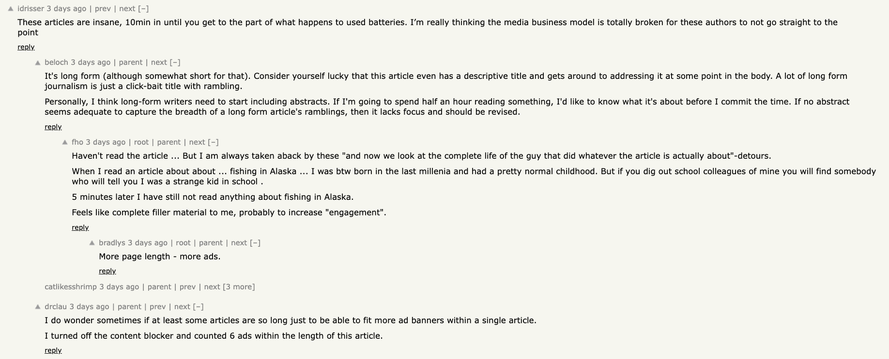

Are internet tech news articles online getting "pointlessly" longer in order to increase engagement/ad revenue? 
Overview

For my final project I will be attempting an analysis on a subset of online publications to attempt to determine objectively if they are longer while providing less substantive content. At a high level I will attempt to see if the word count of articles has increased while the relationship of the content to the subject of the article has decreased. 
Motivation

Recently when attempting to read articles with interesting subjects that I find on a news aggregator site hacker news I will find myself quickly losing interest due to the length of the article and a glut of content that doesn't seem to be providing any useful context or information related to the subject of the article. While my feeling is subjective, I am not alone in this feeling. The top comments for a recent Wired.com article titled Cars Are Going Electric. What Happens to the Used Batteries?, lodge a complaint that it took them 10 minutes of reading just to get to the part about what happens to the batteries. Several other sub-comments add to this speculating that articles are pointlessly increasing in length in order to increase ad-revenue.
comments

https://www.wired.com/story/cars-going-electric-what-happens-used-batteries/
- Proposal describes your motivation for performing this analysis.
- Proposal describes likely data sources.

- Your project has a recognizable “data science workflow,” such as the OSEMN workflow or Hadley Wickham’s Grammar of Data Science. [Example: First the data is acquired, then necessary transformations and clean-up are performed, then the analysis and presentation work is performed]
- Project includes data from at least two different types of data sources (e.g., two or more of these: relational or CSV, Neo4J, web page [scraped or API], MongoDB, etc.)
- Project includes at least one data transformation operation. [Examples: transforming from wide to long; converting columns to date format]
- Project includes at least one statistical analysis and at least one graphics that describes or validates your data.
- Project includes at least one graphic that supports your conclusion(s).
- Project includes at least one statistical analysis that supports your conclusion(s).
- Project includes at least one feature that we did not cover in class!
  - There are many examples: “I used ggmap; I created a decision tree; I ranked the results; I created my presentation slides directly from R; I figured out to use OAuth 2.0…”
  
- Presentation. Was the presentation delivered in the allotted time?
- Presentation. Did you show (at least) one challenge you encountered in code and/or data, and what you did when you encountered that challenge? 
  - If you didn’t encounter any challenges, your assignment was clearly too easy for you!
- Presentation. Did the audience come away with a clear understanding of your motivation for undertaking the project?
- Presentation. Did the audience come away with a clear understanding of at least one insight you gained or conclusion you reached or hypothesis you “confirmed” (rejected or failed to reject…)?

- Code and data. Have you delivered the submitted code and data where it is self-contained—preferably in rpubs.com and GitHub? 
- Am I able to fully reproduce your results with what you’ve delivered? You won’t receive full credit if your code references data on your local machine!
- Code and data. Does all the delivered code run without errors?
- Code and data. Have you delivered your code and conclusions using a “reproducible research” tool such as RMarkdown?

- Deadline management. Were your draft project proposal, project, and presentation delivered on time? Any part of the project that is turned in late will receive a maximum grade of 80%. Please turn in your work on time! You are of course welcome to deliver ahead of schedule!