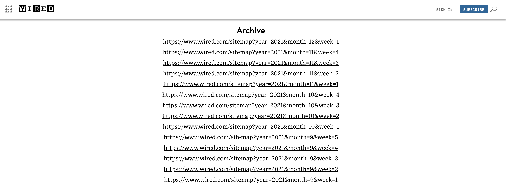
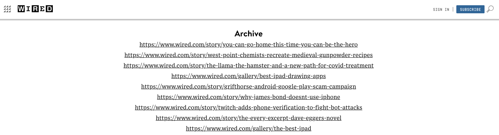
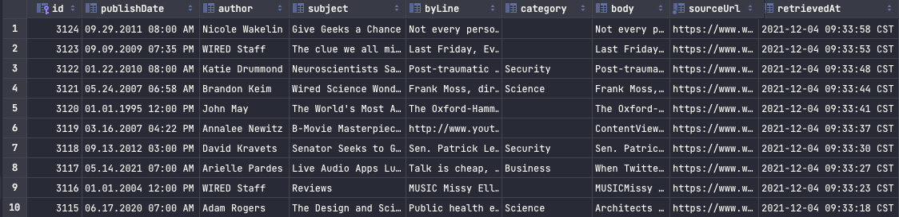
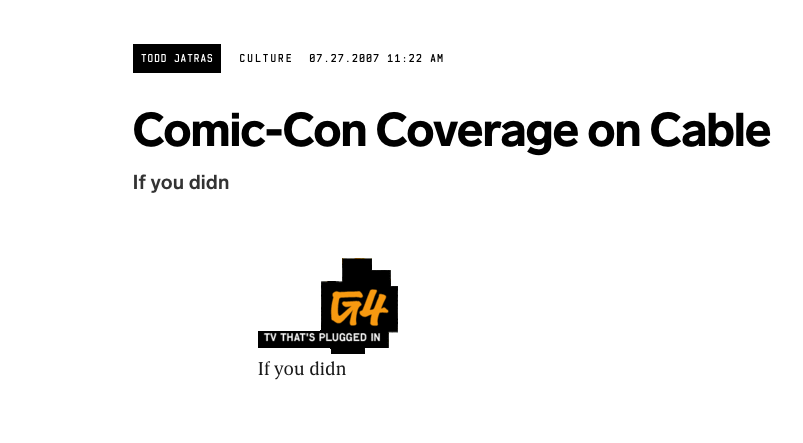

```{r}
library(kableExtra)
```


# Are Web Publications Padding Their Articles For Ad Engagement?

My final project is an investigation into the question of if online web publications have been needlessly padding the length of articles in order to increase ad revenue. 

## Background

### Data Sources

My primary data source was the online news website Wired.com[^1]. Wired.com, initially founded as a print magazine, has been operating an online technology focuses web publication site since 1994. I chose Wired.com for two reasons, because they have a their entire backlog of articles going back to 1993 easily accessible via their site map and two because one of their articles was the initial inspiration for this project.

## Approach

My approach for this project consisted of the following:

1. Use web scraping in R to obtain article data from Wired.com
2. Use API calls to NYT Open API to obtain secondary article data
3. Tidy the article data
4. Store the data in a SQL database for long-term storage and retrieval
5. Perform analysis on the article data

### Web Scraping With R

> Web scraping code can be found [here](https://github.com/nolivercuny/data607/blob/master/FinalProject/finalProject_data_scraping.Rmd)

To scrape the article data from the Wired.com website I primarily used the `rvest`` library.

The scraping process was broken into two distinct steps.

#### Sitemap Scraping

First was reading their sitemap, which conveniently was a very simple page containing a list of links from 2021 back to 1992.



Each link in the sitemap then directs you to a page that contains links to the actual articles. 


Due to the large amount of articles scraping every article would be impractical and would likely result in a block or ban of some sort from the Wired.com's team. For that reason I chose to sample a range of articles from each year that the Wired.com published articles.

Reading the links from the sitemap only required a simple `rvest` call which I have below
```r
read_html(siteMapUrl) %>%
  html_nodes(".sitemap__section-archive > ul > li > a")
```

To obtain a reasonable subset of the articles I simply used the `sample` function on the top-level archive links like so
```r
sample(archiveLinkNodes, 150)
```
I then verified that I had at least one link for every year using the following code to extract the year from the URL, list the unique years, and sort for easier verification.
```r
sampledArchiveLinks %>%
  stringi::stri_extract_all_regex("(?<=year=)[0-9]+") %>%
  unlist() %>%
  unique() %>%
  parse_number() %>%
  sort()
```

Finally I was left with a simple dataframe which contained a link to an article and the archive source. Here is a sample of what that data looks like for demonstration purposes.
```{r}
linksDf <- read.csv('final_project_sitemap.csv', nrows=5)
kable(linksDf)
```

#### Scraping Articles Contents

The next step was to scrape the contents of the articles. Again I used the `rvest` library to do the work here.

Scraping the article contents involved more in-depth analysis of the HTML that made up an article. Luckily Wired.com does not invoke any anti-scraping measures and uses relatively simple strucute to display their articles. 

For example to read the body of the article I simply had to select the `.body__inner-container` class.
```r
articleBody <- html %>% 
  html_node(".body__inner-container") %>% 
  html_text() %>%
  convertToEmptyString()
```
To streamline the processing of the articles I created a function which took in the html of the article, parsed the contents, and returned a vector containing the contents of the article. 
```r
extractArticleContent <- function(html) {
...
c(publishDate, author, subject, byLine, category, articleBody)
}
```

I identified 6 distinct parts the article to read and save.

- Publish date
- Author
- Subject
- By Line
- Category
- Body

To prevent hosting Wired.com's article content from my private GitHub I did not include any CSV's of the scraped content in my repository but here is a screenshot of the Database with some articles selected for demostration purposes




#### Handling Failure & Avoiding Getting Banned

Because web scraping involves a lot of calls over the internet it has a high potential of failure. In order to keep the process as resilient as possible I used the Try/Catch/Finally feature of the R language to handle failures. 

For those not familiar with the Try/Catch/Finally paradigm, you can understand it by breaking it down by each word. First you put code inside a `tryCatch` block which you want your `R` code to attempt to execute. If there is any error for any reason your `error` function will "catch" the error and allow you to do some debugging or rollback with that error. The `finally` function, which is option, always executes regardless of if there was an error or not. This allows you to do things such as closing a database connection or like in my case sleeping. While the `R` language implements Try/Catch/Finally differently than some other languages I am familiar with the paradigm is still the same.

In addition I utilized my Database to prevent re-processing duplicates by selecting only links which haven't already been saved in my Database.

The following code is what I used with some parts removed for brevity

```r
#Open DB connection
...

#Get list of articles we haven't retrieved yet
links <- dbGetQuery(con, "select lx.link
from LinksXref lx
left join Articles a on a.sourceUrl = lx.link
where a.sourceUrl is null;") 

#Create empty DataFrame to store articles with columns that match our DB table
...

#Grab random sample of 100 articles
for(article in sample(links$link,100)){
    tryCatch(expr={
      html <- read_html(article)
      data <- extractArticleContent(html)
      # Add data to DF
      ...
    },error=function(e){
      message(paste("Failed on article ", article))
      message(e)
    },finally = {
      message(paste("Processed URL:", article))
      # Sleep for a random number of seconds to avoid banning
      Sys.sleep(sample(1:5, 1))
    })
}
#Write articles out to table
dbWriteTable(con,"Articles",articlesDf, append=TRUE)
```

As you can see above I also included a random sleep interval in the finally block to prevent a large number of requests hitting Wired.com's servers in a short amount of time. The intention is to stay under the radar and prevent setting off any alarms that might be triggered by a high volume of requests from a single IP address source.

In addition to the sleep timer I utilized a paid Virtual Private Network (VPN) service that I already subscribe to in order to randomize my IP address. 

## Data Manipulation/Tidying

Luckily the data I was able to scrape from the Wired.com was very tidy and required little manipulation in order to be used for my analysis. I did run into a few areas where I needed to handle some quirks of how the articles were strucuted though.

After scraping a large number of articles I looked at my database and realized that I had records with no body but an enormous **Category** field. After looking into it I found that some articles did not have a category which caused the remainder of the scraped data to be shifted over into the wrong fields.

In order to handle this I added a simple function which converted empty fields to NA

```r
missingConvert <- function(variable){
  if(length(variable) == 0) NA else variable
}
```

In addition, I found that some articles were simply devoid of a body altogether due to some publishing error on Wired.com's side or some other reason.

Here is an example screenshot of one such article



To handle this I filtered out articles from analysis which had a body that was empty or contained less than 100 words.

## Analysis

> Full analysis source code can be found [here](https://github.com/nolivercuny/data607/blob/master/FinalProject/finalProject_analysis.Rmd)

My analysis of the article data was also broken into two steps.

The first step consisted of tokenizing the bodies of the articles into words over the years. Then counting the total number of words in the articles for a year, the total number of unique words for a year, and the average number of words per article per year.

Because of the random nature of my sampling I had an uneven amount of articles for a given year e.g. for 2012 I had 248 articles but for 1996 I only had 10. In order to control for this I made sure to analyze my data by randomly selecting the same number of articles from each year.

```r
minSampleSize <- wiredArticlesDf %>% 
  group_by(publishYear) %>%
  count() %>%
  filter(n >= 20) %>%
  min()
articlesGrouped <- wiredArticlesDf %>% 
  group_by(publishYear) %>% 
  #filter(n() > minSampleSize) %>%
  slice_sample(n = minSampleSize) #temp
```

The second part of my analysis utilized the natural language processing technique known as Latent Dirichlet allocation (LDA). Due to my unfamiarity with LDA I borrowed heavily from the Text Mining with R[^2] book.

## Conclusions

Using the data I was able to obtain from Wired.com it is clear that there is a significant increase in online article length especially in recent years. 

## References

[^1]: Nast, C. (n.d.). The latest in technology, Science, Culture and Business. Wired. Retrieved December 5, 2021, from https://www.wired.com/. 
[^2]: Silge, J., &amp; Robinson, D. (2017). Text mining with R: A tidy approach. O'Reilly Media. 